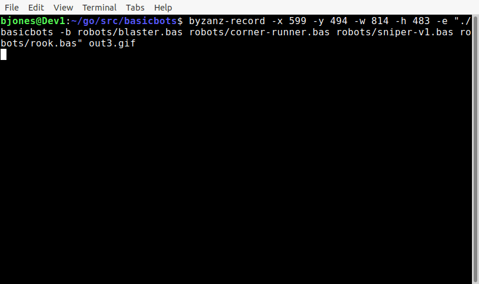
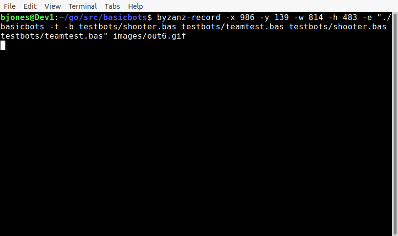

# **BasicBots**🤖

## **What is BasicBots?**
**BasicBots** is a game that gives you the experience of a programming a robot tank to fight other programs in an arena.

## **My Inspiration**
My first exposure to programming combat games was [Tom Poindexter's](https://github.com/tpoindex) original [crobots](http://tpoindex.github.io/crobots/) from 1985, for me it is still a pleasure to play. 

## **User Interface**
I didn't want to lose the look, feel and charm of the original insperation so it has the same ASCII effect that creates an amazing view for the player.

## **Programming Language**
 **BasicBots** uses a subset of *BASIC*. Why *BASIC*? Because, honestly, that's what I wanted. To give the feel of programming on the old 8 bit machines of the late 70s and early 80s. Besides, its fun.
 
## **Build Instruction**
To build basicbots, simply call `make` - this will build Linux and Windows binaries. The OSX port has not been prepared yet.

## **My First Open Source Contribution**

I expect it will take time for me to learn the do's and dont's of managing an Open Source project. 
The project is open for all the contributors to engage and make an impact, improving the game.

- Fixing spelling errors and typos.
- Creating documentation.
- Documenting the code.
- Squashing bugs.
- Adding features.
- Suggesting enhancements.
- Guiding me to a better understanding of Open Source projects.

---

- [basicbots guide](https://github.com/misterunix/basicbots/blob/main/documentation/BASICBOTS.md)

---


<p align="center">
  
</p>

---

## Teams with simple robots.

<p align="center">
  
</p>

## Match with teams
```
./basicbots -t -m 111 testbots/shooter.bas testbots/teamtest.bas testbots/shooter.bas testbots/teamtest.bas
shooter.bas          w:00052 t:00002 l:00057 p:00156
teamtest.bas         w:00052 t:00001 l:00057 p:00131
shooter.bas          w:00057 t:00001 l:00052 p:00172
teamtest.bas         w:00057 t:00002 l:00052 p:00143
Team1                w:00104 t:00003 l:00114 p:00287
Team2                w:00114 t:00003 l:00104 p:00315
```

## Updates
- Nightly builds will be put on hold until I can find a way to automate it.
- Teams is working.
  - Demo and docs coming soon.

## Contributors
- [People who deserve recognition.](docs/CONTRIBUTORS.md)

## Guidlines
- [Contributing](docs/CONTRIBUTING.md)
- [Updates](docs/UPDATES.md)

**connect with me on** 

<div id="badges">
  <span>Twitter: </span>
  <a href="https://twitter.com/misterunix">
    @misterunix
  </a>
  <span>and @basicbots</span>
</div> 
📧 email address: misterunix@gmail.com
Reach out with any questions.
