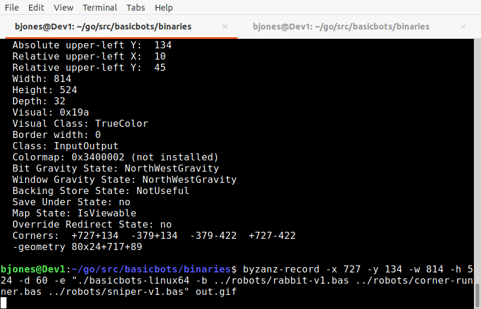

# **basicbots**

## **What is baiscbots?**
basicbots is a programming game where you program your robot tank to compete agaist other robot tanks.

## **What is the inspiration?**
My first introduction to programming combat games was [Tom Poindexter's](https://github.com/tpoindex) original [crobots](http://tpoindex.github.io/crobots/) from 1985. Which is, IMHO, still a whole lot of fun to play. 

## **basicbot's programming language,**
 **basicbots** uses a subset of *BASIC*. Why *BASIC*? Well, because why not? *BASIC* is not a completely dead language, but for those of us old enough this should take you back in time to the versions around the late 1970s and early 1980s. If not, that is okay as well. You can get a sample of what it was like to live in the 8-bit world when computers were simpler.

---
- [basicbots overview and guide](BASICBOTS.md)
- [basicbots basic](BASIC.md)
---

  

## repo rules & guides
- [Code of conduct](CODE_OF_CONDUCT)
- [Style Guide 1](STYLE_GUIDE_1.md)

- [Style Guide 2](STYLE GUIDE 2.md)
- [Effective GO](EFFECTIVE_GO.md)

