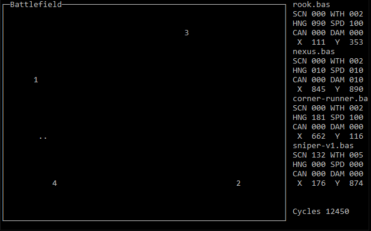

# **basicbots**

## What is it?
**basicbots** is a programming game where you write a program in *BASIC* and have it compete against other robots.

## Releases
- [v0.0.1b](https://github.com/misterunix/basicbots/releases)

## Player Documentation 
- [BASICBOT](https://github.com/misterunix/basicbots/blob/main/documentation/BASICBOTS.md)

## Example match results

    basicbots -m 311 robots/corner-v2.bas robots/corner-runner.bas robots/nexus.bas robots/rook.bas
    corner-v2.bas        w:00305 t:00000 l:00006 p:00915
    corner-runner.bas    w:00002 t:00000 l:00309 p:00006
    nexus.bas            w:00000 t:00000 l:00311 p:00000
    rook.bas             w:00004 t:00000 l:00307 p:00012

corner-v2.bas is out preforming my expections.
   
## Play Testers
- Even if you don't know *BASIC* it's easy to learn. There are resources on the internet about programming in *BASIC*, look for the really old ones. I and as time goes on, others will be more than happy to help out.

## Contributors
- Documentation
- Programming
  - Bug fixes
  - Features
  - Enhancements
  - Commenting
 
## Who am I?
I am an old-school type of guy. I enjoy games from a time when graphics wasn't the main focus of a game and when you died, you had to start over. 

I can be reached via email *misterunix@gmail.com* or on Twitter as *misterunix*. 
